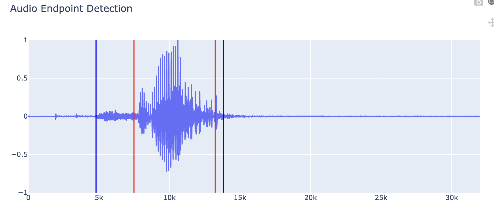

# Naive Bayes Classifier EndPointDetection

## 📚 Introduction

This project implements a Naive Bayes Classifier for endpoint detection in speech signals. The classifier is trained to distinguish between speech and non-speech segments.

## 🛠️ Installation

1. Clone the repository:
    ```bash
    git clone https://github.com/yourusername/naive-bayes-endpoint-detection.git
    ```
2. Navigate to the project directory:
    ```bash
    cd naive-bayes-endpoint-detection
    ```
3. Install the required dependencies:
    ```bash
    pip install -r requirements.txt
    ```
4. run the venv:
    ```bash
    source ./venv/bin/activate
    ```

## 🏋️ Training

To train the Naive Bayes Classifier with dataset:
1. Prepare your dataset with labeled speech and non-speech segments.
2. unzip the zip file
3. your dir structure should be:
    ```bash
    wavfile
        ├── 931915_xylee
        │   ├── 0a_8727_15501.wav
        │   ├── 7b_6614_19194.wav
        │   ├── 8a_7216_13882.wav
        │   ├── 8b_9345_15990.wav
        │   ....
        ├── 931915_yylee
        │   ├── 0a_8727_15501.wav
        │   ├── 7b_6614_19194.wav
        │   ├── 8a_7216_13882.wav
        │   ├── 8b_9345_15990.wav
        │   ....
        ├── 931915_zylee
        │   ├── 0a_8727_15501.wav
        │   ├── 7b_6614_19194.wav
        │   ├── 8a_7216_13882.wav
        │   ├── 8b_9345_15990.wav
        │   ....
    ```
4. run the main.py
    ```bash
    python main.py
    ```

## 🚀 Usage

after training you can eval the model with your own wavfile with run:
```bash
python upload2perf.py
```
or you have own test dataset follow the dir structure:
```bash
python eval.py
```

## 📈 Results

If you run ```upload2perf.py``` The results of the endpoint detection will be displayed in the page and show the detection clip 

